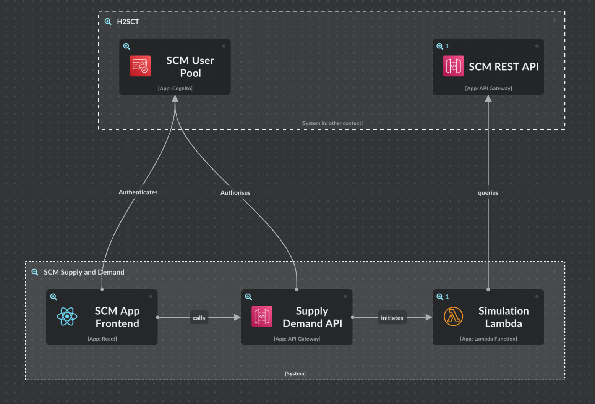

# Hydrogen Supply Chain Management (H2SCM) Supply and Demand

This is a reference application which matches supply and demand based on data within the [Hydrogen Supply Chain Testbed](https://www.hydrologiq.com/api-platform/). It is a self-contained backend frontend application, developed by [Hydrologiq](https://www.hydrologiq.com/) as part of the [Digital Catapult’s Digital Supply Chain Hub](https://www.hydrologiq.com/hydrologiq-announced-as-winner-of-testbed-grant-competition/)

## Architecture

   

## Frontend

The frontend is developed using React and is only available a local web app, see [the documentation](./frontend/README.md) for more information.

## Backend

The backend is deployed using API Gateway and Python Lambdas, whilst using the H2SCT cognito for auth, see [the documentation](./backend/README.md) for more information.

Internally we use [CircleCI](https://circleci.com) for this deployment, you can find our [config file here](./.circleci/config.yml).

### Simulation logic

The simulation logic is where all the magic happens, which includes:

1. Processing the user input and applying potential business rules.
1. Querying the Testbed (H2SCT) for supply chain instances including Hydrogen production sites, Rental and Storage companies
1. Applying logic rules to the data from the supply chain
1. Applying logic matching to the remaining data which are the results of the supply and demand simulation

For more information see the [simulation layer docs](./backend/lambdas/layers/simulation/README.md).

## User account

If you do not already have an account please request one via the [Hydrologiq API Resources page](https://www.hydrologiq.com/api-platform/).
